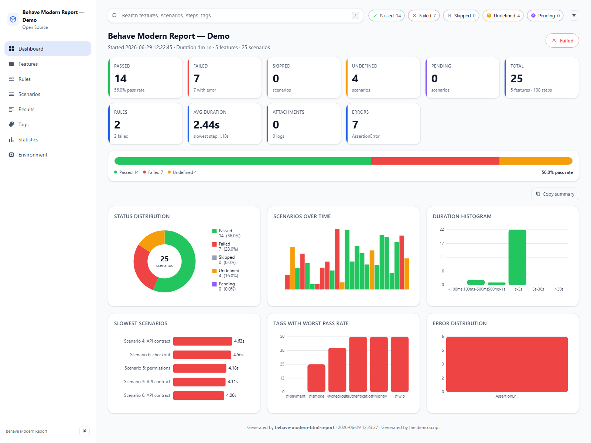
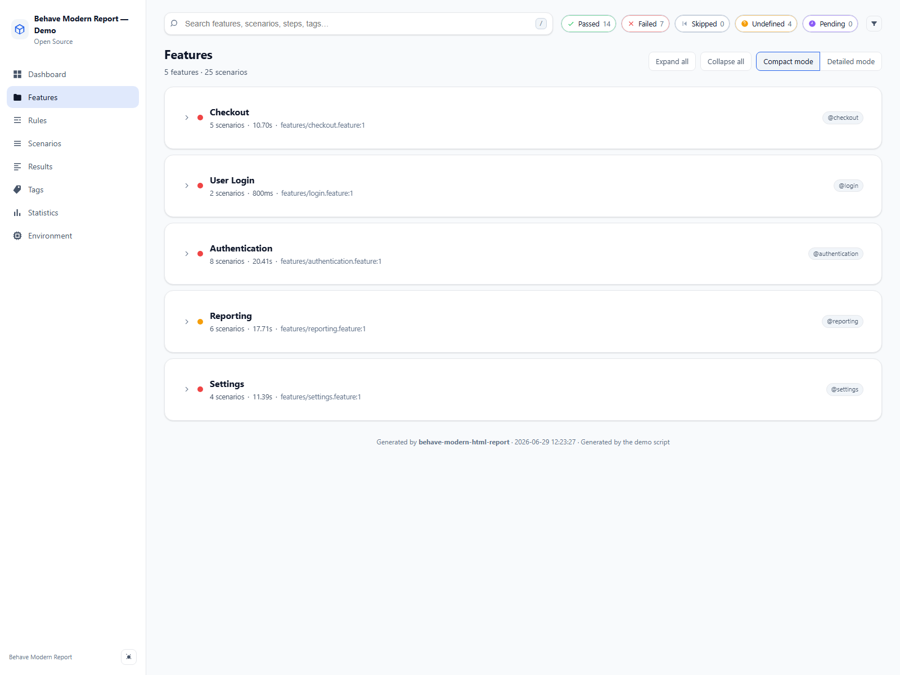
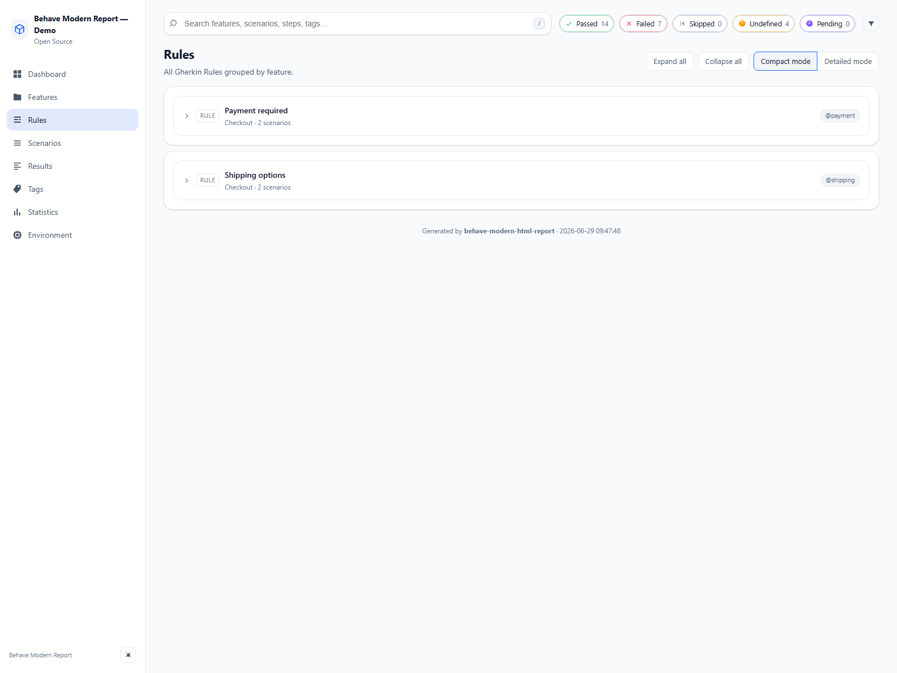
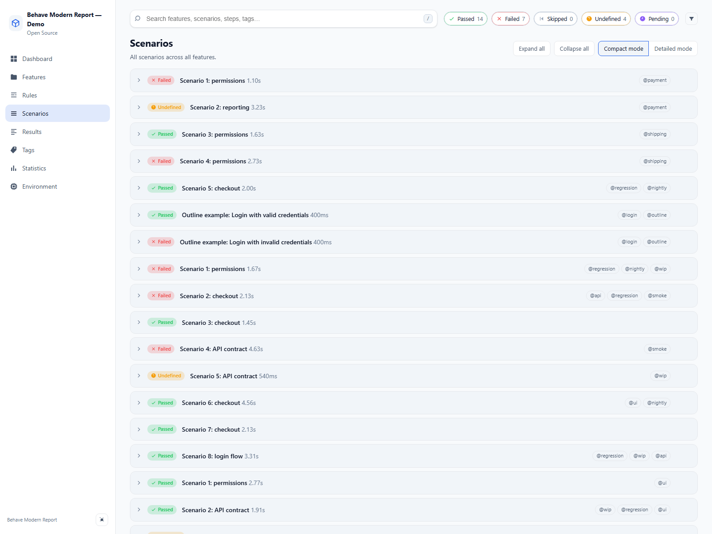
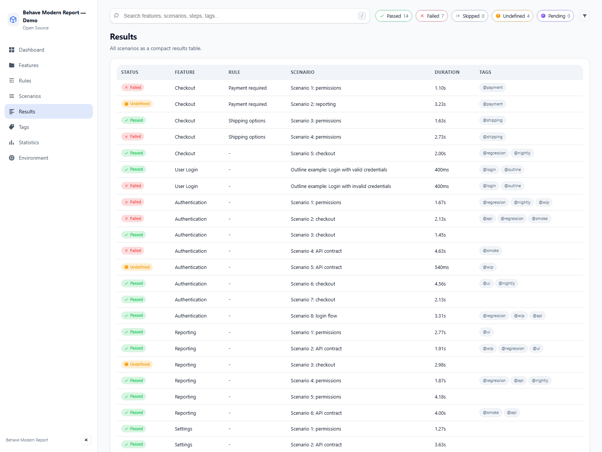
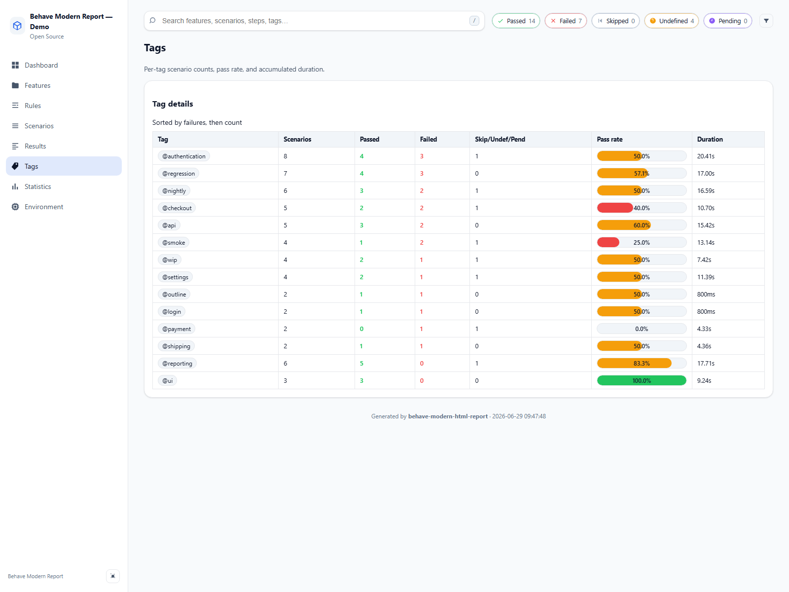
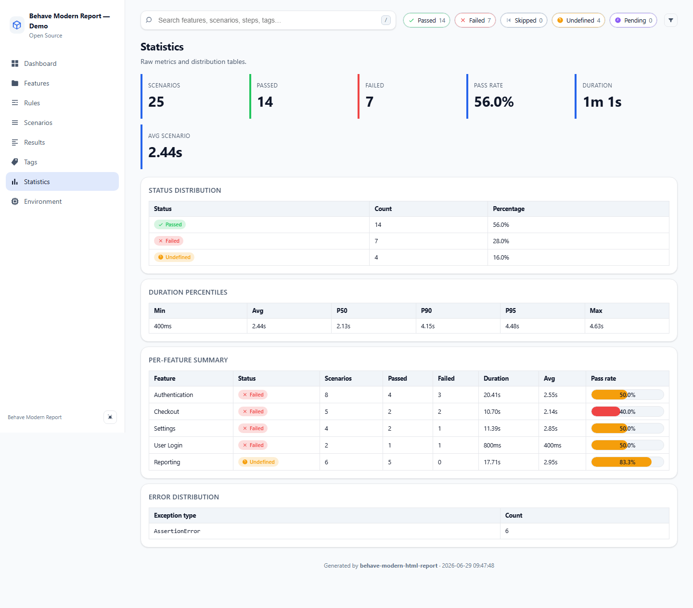
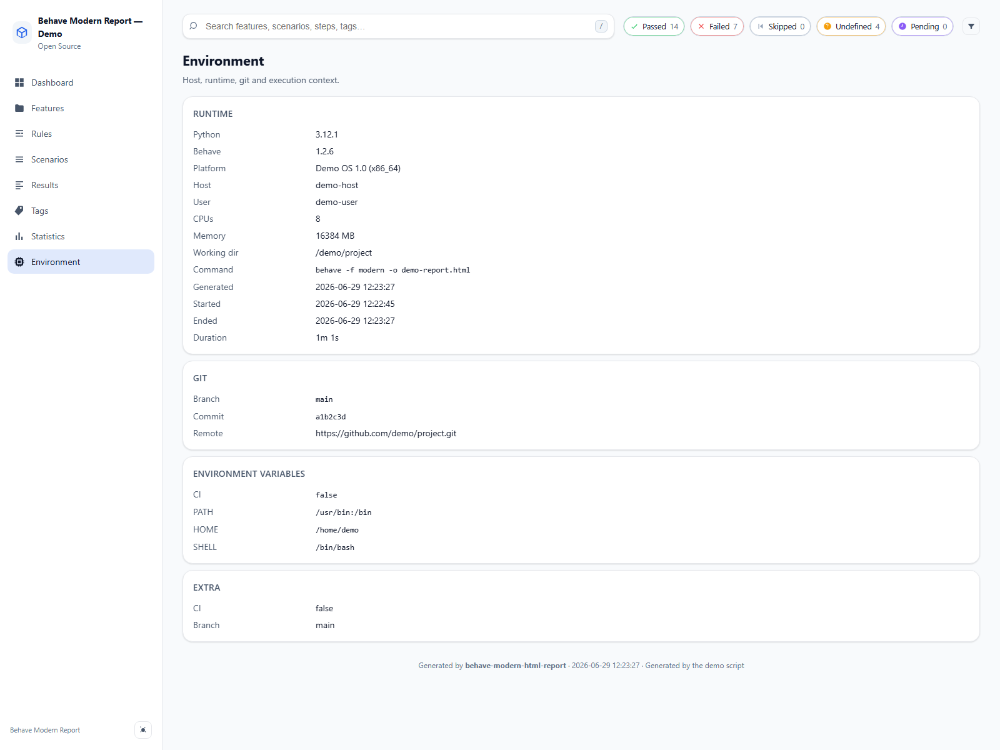

# Behave Modern HTML Report

> The modern, beautiful, single-file HTML report formatter for [Behave](https://behave.readthedocs.io/).
> Dark mode, charts, instant search, attachments, zero external requests.

[](https://pypi.org/project/behave-modern-html-report/)
[](https://pypi.org/project/behave-modern-html-report/)
[](LICENSE)
[](https://github.com/MathiasPaulenko/behave-modern-html-report/actions/workflows/ci.yml)

`behave-modern-html-report` is a drop-in formatter for Behave that produces a single,
self-contained HTML file — everything (CSS, JS, fonts, icons, attachments) is
embedded so the report works offline, on any machine, forever.

## Features

- 🌓 **Dark / Light / Auto** themes, modern Material-3 inspired UI
- 📊 **Interactive charts** (status pie, duration histogram, slowest scenarios, tag pass rate, timeline) — pure vanilla JS, no Chart.js CDN
- 🏷️ **Tag analytics** page: per-tag counts, pass rate, duration, and a dedicated chart
- � **Gherkin Rules** support: scenarios under a `Rule` are grouped and tagged correctly (Behave 1.3.x)
- �🔍 **Instant client-side search** across features, scenarios, steps and tags
- 🎚️ **Filter by status** with one click
- 📁 **Expandable** features → scenarios → steps with rich metadata
- 🧯 **Modern error viewer** with copy-to-clipboard tracebacks
- 🖼️ **Attachments**: images (with lightbox), JSON, text, binaries
- 🚀 **Copy-reproduce-command** per scenario (`behave features/example.feature:3`)
- 📊 **Inline step duration bars** to spot slow steps at a glance
- ♿ **Accessible**: keyboard navigation, ARIA labels, reduced-motion support
- 📦 **Single HTML file**, works offline, no web server, no CDN
- 🧩 **Clean architecture** — formatter / collector / models / renderer separation, fully testable
- 🛠️ **Extensible** — custom CSS/JS, custom title/logo/company, JSON sidecar, future plugin system
- 📋 **Step catalog** — static analysis formatter that extracts all step definitions with patterns, params, source and metrics

## Installation

```bash
pip install behave-modern-html-report
```

## Quick start

In your project's `behave.ini` (or `setup.cfg`):

```ini
[behave.formatters]
modern = behave_modern_html_report.formatter:ModernHTMLFormatter
```

Then run:

```bash
behave -f modern -o report.html
```

Open `report.html` in any browser. Done.

## Configuration

All reporter options are read from `behave`'s `userdata` section. Set them in `behave.ini`, `setup.cfg`, or programmatically from `environment.py`:

```ini
[behave.userdata]
bmr.title         = My Awesome Suite
bmr.company       = Acme Inc.
bmr.logo          = https://example.com/logo.svg
bmr.favicon       = https://example.com/favicon.ico
bmr.theme         = auto          ; auto | dark | light
bmr.primary_color = #3b82f6
bmr.accent_color  = #22c55e
bmr.default_view  = dashboard     ; dashboard | features | scenarios | ...
bmr.hidden_views    = rules,statistics
bmr.expand_by_default = false
bmr.max_slowest   = 10
bmr.show_copy_command = true
bmr.show_environment_vars = true
bmr.footer_text   = Build #12345
bmr.link_to_ci    = https://ci.example.com/build/12345
bmr.json_sidecar  = true          ; writes report.json next to report.html
bmr.custom_css    = path/to/extra.css
bmr.custom_js     = path/to/extra.js
```

Available options:

- `bmr.title` — report title (default `Behave Modern Report`).
- `bmr.company` — company name shown under the title.
- `bmr.logo` / `bmr.favicon` — URL or base64 data URI for a logo/favicon.
- `bmr.theme` — `auto`, `dark` or `light`.
- `bmr.primary_color` / `bmr.accent_color` — override the report colors.
- `bmr.default_view` — initial view (`dashboard`, `features`, `scenarios`, ...).
- `bmr.hidden_views` — comma-separated views to hide (e.g. `rules,statistics`).
- `bmr.expand_by_default` — expand all sections on load.
- `bmr.max_slowest` — number of slowest scenarios on the dashboard.
- `bmr.show_copy_command` — show the copy reproduce command button.
- `bmr.show_environment_vars` — show the environment variables card.
- `bmr.footer_text` — custom footer line.
- `bmr.link_to_ci` — "View in CI" button URL.
- `bmr.json_sidecar` — write `report.json` next to the HTML report.
- `bmr.custom_css` / `bmr.custom_js` — embed custom CSS/JS files.

See [docs/configuration.md](docs/configuration.md) for the full reference.

## Behave 1.3.x and Gherkin Rules compatibility

`behave-modern-html-report` is tested against Behave 1.3.x and fully supports the Gherkin `Rule` keyword.

- Scenarios under a `Rule` keep their parent rule name and inherit their Rule tags correctly.
- Extended final statuses (`error`, `hook_error`, `cleanup_error`, `xfailed`, `xpassed`, `pending_warn`) are normalised and displayed in the UI.
- Error-like statuses are grouped as failures for feature status and tag analytics.

```gherkin
Feature: Checkout

  Rule: Payment required
    @payment
    Scenario: Card payment succeeds
      Given the user has items in cart
      When they pay with a valid card
      Then the order is confirmed
```

## Attachments from your `environment.py`

Use the public helper API — no need to reach into the formatter:

```python
from behave_modern_html_report import attach_screenshot, attach_text, log

def after_step(context, step):
    if step.status == "failed":
        attach_screenshot(context, context.browser, name="failure.png")
        attach_text(context, str(step.exception), name="error.txt")
        log(f"URL at failure: {context.browser.current_url}")
```

The helpers also work with Playwright, Selenium, PIL images, bytes, files, and JSON data.

## Generate a demo without running Behave

```bash
python examples/demo_generator/generate_demo.py
```

This builds `examples/demo_generator/demo-report.html` with a realistic-looking suite —
useful for previews, screenshots, and design iteration.

## Screenshots

### Dashboard view



### Features view



### Rules view



### Scenarios view



### Results view



### Tags view



### Statistics view



### Environment view



## Architecture

```text
behave events
    │
    ▼
 formatter.py ── thin adapter
    │
    ▼
 collector.py ── builds the model tree
    │
    ▼
   models.py  ── pure dataclasses
                (Execution → Feature → Rule-aware Scenario → Step)
    │
    ▼
 statistics.py ── aggregates counters, durations, buckets
    │
    ▼
 renderer.py  + templates/ + assets/  ── Jinja2 → single HTML file
```

The renderer is **independent of Behave**, so any tool that can produce an
`Execution` object (e.g. a JSON loader) can use it.

## Development

```bash
pip install -e ".[dev]"
pytest
ruff check .
```

## Documentation

- [Usage](docs/usage.md) — installation, basic configuration, and running.
- [Configuration](docs/configuration.md) — all reporter options and userdata keys.
- [Report views](docs/views.md) — what each view shows.
- [Examples](docs/examples.md) — demo generator and functional Behave project.
- [Architecture](docs/architecture.md) — how the formatter is structured.
- [Contributing](docs/contributing.md) — local setup, checks, and conventions.

## License

[MIT](LICENSE) © Mathias Paulenko
